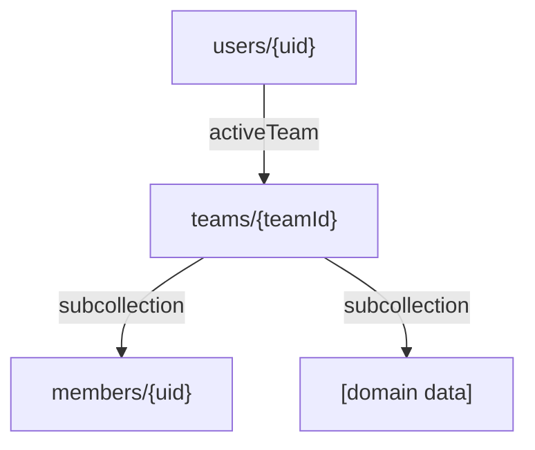

# [App Name] — Data Schema Registry
**Version:** 1.0  
**Last Updated:** YYYY-MM-DD  
**Owner:** Lucia

---

## Overview

This file is the **single source of truth** for the app's Firestore data model.

**Rules:**
1. Update this file **before** changing code (docs are truth)
2. Every collection must have a Zod schema in `src/lib/schemas/`
3. No untyped Firestore writes — all writes must pass through Zod validation

---

## Collections

### `users/{uid}`
**Scope:** Global (not tenant-scoped)  
**Purpose:** User profile and device-level settings

| Field | Type | Required | Description |
|-------|------|----------|-------------|
| `email` | `string` | ✅ | Firebase Auth email |
| `displayName` | `string` | ✅ | User display name |
| `photoURL` | `string` | ❌ | Avatar URL |
| `activeTeam` | `string` | ✅ | Currently selected team ID |
| `createdAt` | `timestamp` | ✅ | Account creation date |

**Subcollections:**
- `users/{uid}/fcmTokens/{tokenId}` — Push notification tokens

---

### `teams/{teamId}`
**Scope:** Tenant root  
**Purpose:** Team/organization entity

| Field | Type | Required | Description |
|-------|------|----------|-------------|
| `name` | `string` | ✅ | Team display name |
| `ownerId` | `string` | ✅ | Creator's UID |
| `createdAt` | `timestamp` | ✅ | Team creation date |
| `plan` | `string` | ❌ | Subscription plan |

**Subcollections:**
- `teams/{teamId}/members/{uid}` — Team membership
- `teams/{teamId}/[domain collections]` — All tenant-scoped data

---

### `teams/{teamId}/members/{uid}`
**Scope:** Tenant-scoped  
**Purpose:** Explicit membership record

| Field | Type | Required | Description |
|-------|------|----------|-------------|
| `role` | `string` | ✅ | `owner` / `admin` / `member` / `viewer` |
| `status` | `string` | ✅ | `active` / `invited` / `removed` |
| `createdAt` | `timestamp` | ✅ | Join date |

---

<!-- ADD YOUR DOMAIN COLLECTIONS BELOW -->
<!-- Copy the pattern above for each new collection -->
<!-- Example: teams/{teamId}/invoices/{invoiceId} -->

---

## Relationships



---

## Indexes

| Collection | Fields | Order | Purpose |
|-----------|--------|-------|---------|
| `teams/{teamId}/members` | `status`, `role` | ASC, ASC | Filter active members by role |

---

## Migration Log

| Date | Change | Migration | Breaking? |
|------|--------|-----------|-----------|
| YYYY-MM-DD | Initial schema | None (greenfield) | No |

**Migration rules:**
- **Adding optional field:** No migration needed; update SCHEMA.md + Zod schema
- **Adding required field:** Write backfill script; run before deploying new code
- **Renaming field:** Write migration script; update all reads/writes atomically
- **Removing field:** Deprecate first (1 sprint); then remove in next sprint

---

## Zod Schema Location

All Zod schemas live in `src/lib/schemas/`:
```
src/lib/schemas/
  user.ts          # userSchema, userCreateSchema
  team.ts          # teamSchema, teamCreateSchema
  member.ts        # memberSchema
  [domain].ts      # One file per domain entity
  index.ts         # Re-exports all schemas
```

**Usage:**
```typescript
import { invoiceCreateSchema } from '@/lib/schemas/invoice';

// Before writing to Firestore:
const validated = invoiceCreateSchema.parse(data);
await setDoc(doc(db, `teams/${teamId}/invoices/${id}`), validated);
```

---

**Owner:** Lucia  
**Template Version:** 1.0
